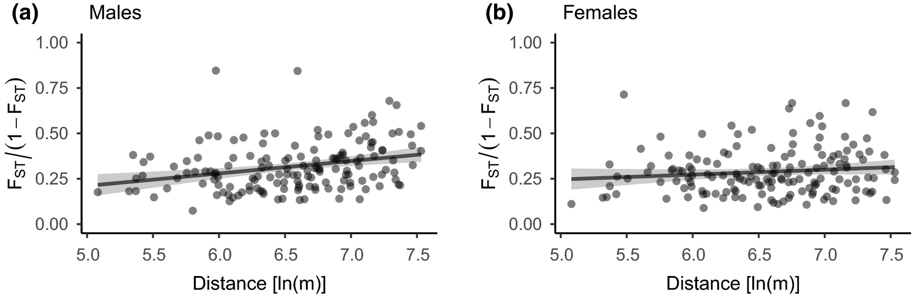
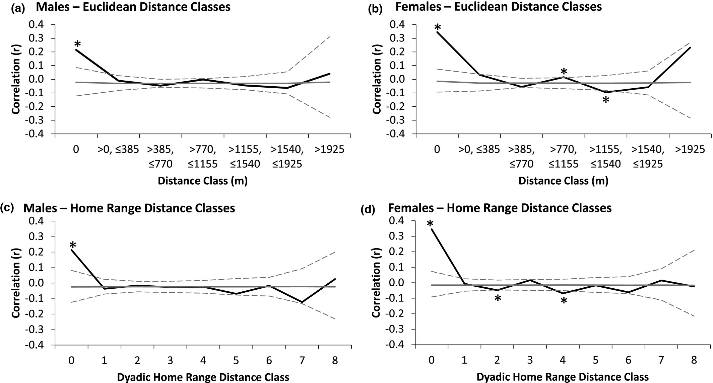
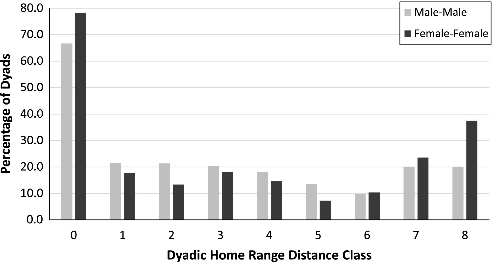

# 1. Introduction

## 1.1 Background

The goal of this replication project is to reproduce as accurately as possible
the figures in the paper "*Dispersal patterns in black howler monkeys*
*(Alouatta pigra): Integrating multiyear demographic and molecular data*" by
Sarie Van Belle and Anthony Di Fiore in 2021 (Molecular Ecology).

This paper focuses on examining dispersal patterns in howler monkeys in a region
of Mexico. Animal dispersal is hypothesized to present benefits in the form of
reduction of both inbreeding and kin competition, but comes at the cost of
potentially delayed reproductive access or decreased survival of the individual
and its offspring. Dispersal patterns between the sexes vary greatly between
species, with some species showing *bisexual dispersal* where both sexes will
disperse with equal frequency from their natal groups (the groups they were born
into), while some species show *sex-biased dispersal* where individuals of one
sex disperse with greater frequency than individuals of the other sex.
Complicating matters further is the spectrum of dispersals seen in nature, where
some combination of bisexual and sex-biased dispersal to varying degrees may be
observed even within one group or set of groups, as well as the difficulty of
studying dispersal patterns in the wild. However, genetic analyses of population
substructure may provide insight into dispersal patterns, as the genetic
variation between subgroups in each sex can shed insight into the frequency with
which each sex emigrates. Black howler monkeys (*Alouatta pigra*) are a good
study system because there have been observed instances of bisexual dispersal,
but the degree of male-female dispersal patterns is unknown.

This paper uses a genetic dataset collected from study of several groups of
howler monkeys in Palenque National Park, Mexico from 2006-2007 and 2010-2020.
Genetic data was collected from faecal samples, and individuals were genotyped
by either 18 or 21 polymorphic microsatellite markers. The general assertion is
that a match at all genomic markers represents the same individual, so finding
genetic evidence of one individual in two different group ranges at two
different times would be evidence of a dispersal event.

## 1.2 Original Analyses Conducted

Four main analyses were conducted in the original paper.

- First, dispersal events were recorded and quantified, identifying which
individuals left their natal group, what groups they emigrated from and
immigrated into, and how many males and females dispersed
- Second, global $\small F_{ST}$---a statistical measure of variation between
subgroups---is calculated separately for males and females for adult individuals
in 18 groups.  This is to get a sense of genetic variation between subgroups,
and if this variation differs between sexes.  Small differences in 
$\small F_{ST}$ values should indicate similar rates of dispersal in males and
females.
- Third, spatial autocorrelation was conducted which would show if increased
geographical distance correlated with increased genetic variance (measured as
$\small F_{ST}/(1-F_{ST})$).  The null expectation is that this should be the
case.
- Fourth, mean pairwise relatedness of individuals within groups was compared to
relatedness between groups.  The expectation here is that low dispersal rates
would lead to high difference between within and between group relatedness while
high dispersal rates would lead to low difference, and that differences in
dispersal rate between males and females should be reflected in the difference
in relatednesses between the sexes.

## 1.3 Analyses Reproduced

For this project, I will reproduce the second, third, and fourth analyses.  I
will not be reproducing the geographic group ranges or dispersal figures 
(**Fig1** and **Fig2**) because this analysis was more descriptive than
qualitative and the information about dispersal events was not included in the
data files (it is included in **S Table2** but this is based on observation and
not reproducible).

## 1.4 Formatting notes

Figures and tables in the original paper are denoted in **bold**.

Data files are denoted in *italics*.

R packages, R functions, and outside software are denoted using `code font`.

Throughout the R code, there are commented-out lines with `cat("XXX")`.  These
lines were simply used to keep track of the progress of long-running code chunks,
and can be ignored.  They may also be un-commented to help provide a sort of
progress tracker when running the code locally.

# 2. Results of Replications

## 2.0 Initializing Data

To initialize, I will need to load in all of the following packages, as well
as include code to allow `knitr` to know where to find the images used from
the original paper.

```{r load.libraries,echo=FALSE,warning=FALSE,message=FALSE,error=FALSE}
library(readxl)                               # Read in excel files
library(dplyr)                                # Piping and data wrangling
library(hierfstat)                            # wc() Weir-Cockerham FST estimator
library(ggplot2)                              # Plotting using ggplot
library(ggpubr)                               # Arranging multi-panel figures
library(spdep)                                # Getting neighbors from coordinates
knitr::opts_chunk$set(fig.path = "images/")
```

I will also read in all of the data files for this project.  There are four data
tables publicly available for this paper, and I use all four in this project.

- *Adults2012.xlsx* gives a list of the 65 adult monkeys sampled in 2012 which
were used for the majority of analyses, their sex, and the group to which they
belong
- *GenotypeData_Dryad.csv* gives the genotype of all individuals sampled from
all time periods.  The genotypes are given as "alleleA/alleleB" and represent
repeat counts for 21 microsatellite loci across the genome
- *GeographicCoordinates.csv* gives the coordinates of the centroid of all home
groups observed in 2012, and includes all home groups to which the adults used
for the analyses belonged
- *PairwiseRelatedness_allAdultDyads_2012.xlsx* gives a list of all pairwise
comparisons of two adult individuals, including their relatedness as calculated
using the Queller-Goodnight estimator, their sexes, and the home group to which
they belonged

```{r load.data}
adults <- read_excel("./data/Adults2012.xlsx")
gen <- read.csv("./data/GenotypeData_Dryad.csv")
coords <- read.csv("./data/GeographicCoordinates.csv")
rel <- read_excel("./data/PairwiseRelatedness_allAdultDyads_2012.xlsx")
```

We can view a preview of each of these files to get a sense of the format of the
data, the column names, etc. using the head function, as below:

```{r preview.data}
head(adults)
head(gen)
head(coords)
head(rel)
```

Some data cleaning:

- The "BALAM" group was coded as both "BALAM" and "Balam" in the
*GenotypeData_Dryad.csv* file, so all groups were made to be all uppercase to
keep things consistent
- The individual "AM1-PAK" was listed twice in the *GenotypeData_Dryad.csv*
file, even though the genotypes listed were different, so the second
individual labeled "AM1-PAK" was changed to "AM2-PAK"
- Some individuals were listed twice in the *GenotypeData_Dryad.csv* because
they were sampled in different years, but their genotypes were the same
(indicating these entries were all the same individual) so only the last entry
of each individual was kept to reduce redundancy

```{r clean.data}
gen$Group <- toupper(gen$Group)
gen$Individual[109] <- "AM2-PAK"
gen <- gen[-which(duplicated(gen$Individual,fromLast = TRUE)),]
```

All other tables were checked and confirmed for correctness.

## 2.1 Global $\small F_{ST}$

$\small F_{ST}$ is calculated using the `FSTAT` program, which uses the
Weir-Cockerham $\small F_{ST}$ estimator.

For multiple sub-population samples with differing sample sizes and multiple
alleles at each locus, the Weir-Cockerham $\small F_{ST}$ (denoted in their
paper as $\small \hat{\theta}$) is calculated as

$$
\hat{\theta}_W = \frac{\sum_u{a_u}}{\sum_u{(a_u + b_u + c_u)}}
$$

Where $u$ is each allele and

$$
a = \frac{\bar{n}}{n_c}
\{S^2 - \frac{1}{\bar{n}-1}
[\bar{p}(1-\bar{p}) - \frac{r-1}{r}S^2 - \frac{1}{4}\bar{h}]\}
$$

$$
b = \frac{\bar{n}}{\bar{n}-1}
[\bar{p}(1-\bar{p}) - \frac{r-1}{r}S^2-\frac{2\bar{n}-1}{4\bar{n}}\bar{h}]
$$

$$
c = \frac{1}{2}\bar{h}
$$

where

- $\tilde{p}_i$ is the observed frequency of allele $u$ in the sample from
sub-population $i$
- $n_i$ is the size of sample $i$
- $\tilde{h}_i$ is the observed frequency of heterozygotes for allele $u$
- $\bar{n} = \sum_{i}{n_i/r}$, the average sample size
- $n_c = (r\bar{n} - \sum_{i}{n_i^2/r\bar{n}})/(r-1)$
- $\bar{p} = \sum_i{n_i\tilde{p}_i/r\bar{n}}$, the average sample frequency of
allele $u$
- $S^2 = \sum_i{n_i(\tilde{p}_i-\bar{p})^2/(r-1)\bar{n}}$, the sample variance
of allele $u$ frequencies over populations
- $\bar{h} = \sum_i{n_i\tilde{h}_i/r\bar{n}}$, the average heterozygote
frequency for allele $u$

To begin this analysis, only adults in the 18 study groups sampled from in 2012,
which are the individuals and groups listed in the *Adults2012.xlsx*.  This
meant that I had to reduce the *GenotypeData_Dryad.csv* to only those
individuals who are listed in the *Adults2012.xlsx*, which I store as a new
dataframe.  These individuals were simply identified manually by their ID in
*Adults2012.xlsx*.

```{r format.for.WC}
a_names <- c("Luz","Teresa","Kriek","Guz","Anon","Dinka","Puma","Rafiki",
            "BRA-AF","BRA-AM","CAL-AF1","CAL-AF2","CAL-AM1","CAL-AM2","CRU-AF1",
            "CRU-AF2","CRU-AM","JAG-AF1","JAG-AF2","JAG-AM1","JAG-AM2","MBL-AF1",
            "MBL-AF2","MBL-AM1","MBL-AM2","MDK-AF","MDK-AM","Isa","Melanie",
            "Hugo","Jupiler","MUS-AF","MUS-AM","Zita","NAH-AF1","NAH-AM1","Lineo",
            "Emma","Esa","Parcha","Pura","Roco","Sibal","PIG-AF1","PIG-AF2",
            "PIG-AM1","PIG-AM2","TC2-AF1","TC2-AF2","TC2-AM","TNO-AF1","TNO-AF2",
            "TNO-AM1","TNO-AM2","TNO-AM3","TOL-AF1","TOL-AF2","TOL-AM","Galena",
            "Lola","Mona","Boquinche","Dinde","WPS-AF","WPS-AM")
gen_a <- gen %>% filter(Individual %in% a_names)
gen_a <- gen_a[order(match(gen_a$Individual,a_names)),]
gen_a$Sex <- adults$Sex
gen_a$Group[which(gen_a$Individual == "Pura")] <- "PAKAL"
gen_a$Group[which(gen_a$Group == "NAH")] <- "NAHA"
gen_a <- gen_a[order(gen_a$Group),]
gen_test <- gen_a
```

I will also be using the `wc()` function from the `hierfstat` package, which
computes the Weir-Cockerham $\small F_{ST}$ estimate.  To use this function, I
need to have a dataframe which consists of a column of the sub-populations (as
numeric factors) as well as one column per locus, with the alleles coded as
numeric factors (next to each other, without any characters in between, e.g.,
"272/272" = 11, "272/280" = 12).

```{r global.FST}
# Converting all genotypes for all loci to the appropriate format for wc()
for(l in 5:25){
  alleles <- data.frame(A = unlist(strsplit(gen_a[[l]],"[/]"))[c(TRUE,FALSE)],
                        B = unlist(strsplit(gen_a[[l]],"[/]"))[c(FALSE,TRUE)])
  alleles$a <- as.numeric(factor(alleles$A,
                                 levels = unique(c(alleles$A,alleles$B))))
  alleles$b <- as.numeric(factor(alleles$B,
                                 levels = unique(c(alleles$A,alleles$B))))
  gen_a[[l]] <- as.numeric(paste0(alleles$a,alleles$b))
}
gen_a$Group <- as.numeric(factor(gen_a$Group))

# Splitting adult data by sex
gen_f <- gen_a %>% filter(Sex == "F") %>% select(c(2,5:25))
gen_m <- gen_a %>% filter(Sex == "M") %>% select(c(2,5:25))

# Using the wc() function
FST_f <- wc(gen_f)$FST
FST_m <- wc(gen_m)$FST

cat("\nGlobal Female FST Estimate =",FST_f)
cat("\nGlobal Male FST Estimate   =",FST_m,"\n")
```
Confidence intervals can be found, following `FSTAT` documentation, by
performing a bootstrap by randomizing loci (as long as there are 4 or more loci,
here we have 21 loci) by resampling n loci with replacement.  I performed 1,000
bootstrap replicates.

```{r FST.CI}
FSTCI <- function(df,alpha){
  # Function to get confidence intervals for estimates of FST for a given set of
  # genotype data by repeatedly re-samples all loci
  
  # Arguments:
  # df = dataframe containing genotype information
  # alpha = confidence interval cut-off
  
  # Output:
  # Print to console of confidence intervals for females and males
  
  boot <- rep(NA,1000)
  for(i in 1:1000){
    set.seed(i)
    # cat("\rBootstrap Rep ",i,"/1000",sep = "")
    resamp <- df[,c(1,sample(2:22,replace = TRUE))]
    boot[i] <- wc(resamp)$FST
  }
  return(boot)
}

f_boot <- FSTCI(gen_f,0.05)
m_boot <- FSTCI(gen_m,0.05)

f_CI95 <- quantile(f_boot,c(0.025,0.975))
m_CI95 <- quantile(m_boot,c(0.025,0.975))

cat("\nGlobal Female FST 95% CI =",f_CI95[1],"-",f_CI95[2])
cat("\nGlobal Male FST 95% CI   =",m_CI95[1],"-",m_CI95[2])
```

I also calculated global $\small F_{ST}$ by hand by following the above
equations

```{r global.FST.manual}
FST <- c(NA,NA)
names(FST) <- c("F","M")

# Calculate FST manually using equations from Weir-Cockerham (1984)

# Loop over each sex
for(s in names(FST)){
  # cat("\nCurrent Sex",s,"\n\n")
  gen_s <- gen_test %>% filter(Sex == s)
  numerl <- c()
  denoml <- c()
  r <- length(unique(gen_s$Group))
  
  # Loop over all loci
  for(l in 5:25){
    numeru <- c()
    denomu <- c()
    # cat("\rCompleted Locus ",l-4,"/21",sep = "")
    genotypes <- data.frame(I = gen_s$Individual,
                            A = unlist(strsplit(gen_s[[l]],"[/]"))[c(TRUE,FALSE)],
                            B = unlist(strsplit(gen_s[[l]],"[/]"))[c(FALSE,TRUE)])
    
    # Loop over all alleles in each locus
    for(u in unique(c(genotypes$A,genotypes$B))){
      ni <- rep(NA,r)
      pi <- rep(NA,r)
      hi <- rep(NA,r)
      for(g in 1:r){
        gen_i <- genotypes[which(gen_s$Group == unique(gen_s$Group)[g]),]
        ni[g] <- nrow(gen_i)
        pi[g] <- length(which(c(gen_i$A,gen_i$B) == u))/length(c(gen_i$A,gen_i$B))
        hi[g] <- gen_i %>% filter((A == u | B == u) & (A != B)) %>%
          nrow()/length(gen_i$A)
      }
      nbar <- sum(ni/r)
      nc <- ((r*nbar) - sum((ni^2)/(r*nbar)))/(r-1)
      pbar <- sum((ni*pi)/(r*nbar))
      s2 <- sum((ni*((pi - pbar)^2))/((r-1)*nbar))
      hbar <- sum((ni*hi)/(r*nbar))

      a <- (nbar/nc)*
        (s2 -
           ((1/(nbar-1))*
              ((pbar*(1-pbar)) -
                 (((r-1)/r)*s2) -
                 (hbar/4)
               )
            )
         )
      b <- (nbar/(nbar-1))*
        ((pbar*(1-pbar)) -
           (((r-1)/r)*s2) -
           ((((2*nbar)-1)/(4*nbar))*hbar)
         )
      c <- hbar/2

      d <- a+b+c

      numeru <- c(numeru,a)
      denomu <- c(denomu,d)
    }
    numerl <- c(numerl,sum(numeru))
    denoml <- c(denoml,sum(denomu))
  }
  FST[s] <- sum(numerl)/sum(denoml)
  # cat("\n\n------------------------------------------------\n")
}

cat("\nGlobal Female FST Estimate =",FST["F"])
cat("\nGlobal Male FST Estimate   =",FST["M"],"\n")
```

Both of these methods yielded the same results, confirming the veracity of both.
However, neither of these results exactly completely matched the results
reported in the original paper, although they are close

- Original Female $\small F_{ST} = 0.164$, CI 0.137 - 0.213; reproduced Female 
$\small F_{ST} = 0.170$, CI 0.136 - 0.203
- Original Male $\small F_{ST} = 0.118$, CI 0.072 - 0.156; reproduced Male
$\small F_{ST} = 0.123$), CI 0.0814 - 0.164.

To reproduce the replication to determine the p-values of each of these
$\small F_{ST}$ values, I performed a sex-randomization permutation test as
described in the text from `FSTAT`.  The process for this involves using the
same global genotype table as was used to find the $\small F_{ST}$ but with
the sex column randomized each time.  This is replicated for 10,000 replications.
Below, histograms show the Null Distributions of male and female $\small F_{ST}$
with the red line indicating where the estimated $\small F_{ST}$ falls.

```{r null.distribution,warning=FALSE}
nulldistF <- rep(NA,10000)
nulldistM <- rep(NA,10000)
gen_rand <- gen_a

# Get null distributions for FST estimates for males and females

# Permute 10,000 times
for(i in 1:10000){
  set.seed(i) # Set seed for replicability
  # cat("\rPermutation Rep ",i,"/10000",sep = "")
  gen_rand$Sex <- sample(gen_rand$Sex)
  nulldistF[i] <- wc(gen_rand[which(gen_rand$Sex == "F"),c(2,5:25)])$FST
  nulldistM[i] <- wc(gen_rand[which(gen_rand$Sex == "M"),c(2,5:25)])$FST
}

# Get histograms of null distributions
hist(nulldistF,breaks = 30,main = "Null Distribution of Female FST",
     xlab = "FST")
abline(v = FST_f,col = "red",lty = "dashed")
hist(nulldistM,breaks = 30,main = "Null Distribution of Male FST",
     xlab = "FST")
abline(v = FST_m,col = "red",lty = "dashed")

# Get p-values for estimated FST vs Null
pval_f <- sum(length(which(nulldistF < -abs(FST_f))),
              length(which(nulldistF > abs(FST_f))))/10000
pval_m <- sum(length(which(nulldistM < -abs(FST_m))),
              length(which(nulldistM > abs(FST_m))))/10000
cat("\nGlobal Female FST p-value =",pval_f)
cat("\nGlobal Male FST p-value   =",pval_m,"\n")
```

Interestingly, this analysis revealed that of the two $\small F_{ST}$ values,
only the female $\small F_{ST}$ was significant, while the male $\small F_{ST}$
was not; this is different from the original analysis which concluded that both
of these estimates were significant.  Given that the actual values for
$\small F_{ST}$ were similar between replicated and original, I am unsure why
the significance should be so different.

We can get level of significance between Male and Female $\small F_{ST}$ values
by seeing how much overlap there is between the bootstrapped distributions for
each sex, specifically how much overlap there is of the 95% confidence intervals.

```{r FST.significance}
# Compare FST estimates between sexes
pval_fm <- (length(which(f_boot < quantile(m_boot,0.975))) +
              length(which(m_boot > quantile(f_boot,0.025))))/
  length(c(f_boot,m_boot))

cat("The p-value between each sex-specific FST =",pval_fm)
```

This test confirms that the $\small F_{ST}$ values for each sex do not differ
significantly from each other (p-value = 0.324).  This p-value is fairly
similar to the between-sex $\small F_{ST}$ p-value found in the original paper.

## 2.2 Spatial Autocorrelation

To perform spatial autocorrelation analysis, I generated group-based pairwise
$\small F_{ST}$ calculations (i.e., $\small F_{ST}$ calculated between two
different groups, for all pairs of groups) as opposed to the global
$\small F_{ST}$ from the previous step which took all groups into account
simultaneously.  This can be achieved by using the same genotype table as
before but this time subsetting by only the individuals from two different
groups and looping over all of the group pairs.  Again, only adult individuals
from the groups sampled in 2012 are considered.

However, because of the structure of the populations and the fact that some
pairwise population comparisons have only one individual per population in one
or both of the sexes, the WC estimator is not quite accurate for estimating
$\small F_{ST}$.  Therefore, for this step I switch to a different
$\small F_{ST}$ estimator which uses observed allele frequencies to generate
estimates of heterozygozity, giving $\small F_{ST} = \frac{H_T - \bar{H}_e}{H_T}$

```{r FST.calc}
calcFST <- function(df,p1,p2){
  # Function to calculate FST using the heterozygozity estimate equations
  
  # Arguments
  # df = dataframe containing genotype data
  # p1 = first pairwise population
  # p2 = second pairwise population
  
  # Outputs
  # FST estimate
  
  HT <- c()
  He1 <- c()
  He2 <- c()
  
  # Looping over all loci
  for(l in 5:25){
    p1g <- as.character(df[which(df[["Group"]] == p1),l])
    p2g <- as.character(df[which(df[["Group"]] == p2),l])
    p1a <- unlist(strsplit(p1g,""))
    p2a <- unlist(strsplit(p2g,""))
    uniqa <- unique(c(p1a,p2a))
    He1i <- 0
    He2i <- 0
    HTi <- 0
    
    # Looping over all alleles for each locus
    for(a in uniqa){
      pa1 <- length(which(p1a == a))/length(p1a)
      pa2 <- length(which(p2a == a))/length(p2a)
      pTa <- length(which(c(p1a,p2a) == a))/length(c(p1a,p2a))
      He1i <- He1i + (pa1^2)
      He2i <- He2i + (pa2^2)
      HTi <- HTi + (pTa^2)
    }
    He1 <- c(He1,He1i)
    He2 <- c(He2,He2i)
    HT <- c(HT,HTi)
  }
  HT <- 1 - HT
  He1 <- 1 - He1
  He2 <- 1 - He2
  Hebar <- (He1/2) + (He2/2)
  num <- HT - Hebar
  FST <- sum(num)/sum(HT)
  return(FST)
}

# Running above function
FSTlist <- list(F = c(),M = c(),pop1 = c(),pop2 = c())
for(s in c("F","M")){
  done <- c()
  gen_s <- gen_a %>% filter(Sex == s)
  for(i in unique(gen_s$Group)){
    for(j in unique(gen_s$Group)){
      # cat("\r                        ")
      # cat("\rPop",i,"&",j)
      if(i == j | j %in% done){next}
      else{FSTlist[[s]] <- c(FSTlist[[s]],calcFST(gen_s,i,j))
      if(s == "F"){FSTlist[["pop1"]] <- c(FSTlist[["pop1"]],i)
      FSTlist[["pop2"]] <- c(FSTlist[["pop2"]],j)}
      }
    }
    done <- c(done,i)
  }
}
```

Geographic distances are calculated as the straight line distance (i.e.,
$D = \sqrt{(x_2-x_1)^2+(y_2-y_1)^2}$), where the geographic coordinates found in
*GeographicCoordinates.csv* are used as the x and y coordinates for this
calculation.  Again, pairwise group combinations of all possible group pairs are
used, and only groups sampled in 2012 are considered.

```{r pairwise.Geo.Distance}
GroupPairs2 <- list(G1 = c(),G2 = c())
DistList <- c()
done <- c()
coords <- coords[order(coords$Group),]

# Get euclidean distance from coordinates
for(i in coords$Group){
  for(j in coords$Group){
    if(i == j | j %in% done){next}
    else{
      coords_ij <- coords %>% filter(Group %in% c(i,j))
      D_ij <- sqrt(((coords_ij$X[2] - coords_ij$X[1])^2) +
                     ((coords_ij$Y[2] - coords_ij$Y[1])^2))
      DistList <- c(DistList,D_ij)
      GroupPairs2[["G1"]] <- c(GroupPairs2[["G1"]],i)
      GroupPairs2[["G2"]] <- c(GroupPairs2[["G2"]],j)
    }
  }
  done <- c(done,i)
}
```

We can also get a Mantel test statistic for each of these correlations.  First,
we convert $\small F_{ST}$ to $\small F_{ST}/(1-F{ST})$, and Geographic Distance
to $ln(Dist)$.  Next, we get the mean of each of the $\small F_{ST}/(1-F{ST})$
for males and females, as well as the mean $ln(Dist)$ to get the sum of squares,
or $SS_x = \sum{(x-\bar{X})^2}$ for all values in all variables; we also
calculate the sum of cross products as $SP_{xy} = \sum{(x-\bar{X})(y-\bar{Y})}$.
Finally, we can get the Mantel statistic $r=SP_{xy}/\sqrt{SS_x * SS_y}$, where
this $r$ is basically a correlation coefficient between the variables.

To set up the function for the mantel test:

```{r Mantel.Test}
mantest <- function(df,s){
  # Function to perform a mantel test to get a measure of correlation between
  # FST/(1 - FST) and log(Distance) according to the Mantel Test equations in
  # GenAlEx tutorials
  
  # Arguments:
  # df = dataframe containing FST and Geographic Distance values
  # s = Sex of interest
  
  # Outputs:
  # Correlation coefficient r
  
  colname <- paste0("Gen_",s)
  X <- df[[colname]]
  Y <- df[["Geo"]]
  SSX <- sum((X - mean(X))^2)
  SSY <- sum((Y - mean(Y))^2)
  SP <- sum((X - mean(X)) * (Y - mean(Y)))
  r <- SP/sqrt(SSX * SSY)
  return(r)
}
```

Now, running the mantel test, which will give a correlation for
$\small F_{ST}/(1 - F_{ST})$ vs. $\small log(Distance)$.  Additionally, I
calculate significance for these correlation coefficients using a permutation
method which randomly permutes the distances while leaving the $\small F_{ST}$
values the same, as described in the methods and in GenAlEx:

```{r run.Mantel.Test}
fig3df <- data.frame(G1 = GroupPairs2$G1,
                     G2 = GroupPairs2$G2,
                     Gen_F = (FSTlist[["F"]]/(1-FSTlist[["F"]])),
                     Gen_M = (FSTlist[["M"]]/(1-FSTlist[["M"]])),
                     Geo = log(DistList))

# Run above mantel test function
rF <- mantest(fig3df,"F")
rM <- mantest(fig3df,"M")

cat("\nCorrelation between FST/(1-FST) and log(Distance) in females =",rF)
cat("\nCorrelation between FST/(1-FST) and log(Distance) in males   =",rM)
cat("\n")

# Permuting 9,999 times
N <- 9999
permF <- rep(NA,N)
permM <- rep(NA,N)
for(i in 1:N){
  set.seed(i)
  # cat("\rRep ",i,"/",N,sep = "")
  di <- fig3df %>% mutate(Geo = sample(Geo))
  permF[i] <- mantest(di,"F")
  permM[i] <- mantest(di,"M")
}

cat("\n")
pvalF <- (length(which(permF > abs(rF))) + length(which(permF < -abs(rF))))/
  length(permF)
pvalM <- length(which(permM > abs(rM))) + length(which(permM < -abs(rM)))/
  length(permM)
cat("\nThe p-value for the correlation coefficient in females =",pvalF)
cat("\nThe p-value for the correlation coefficient in males   =",pvalM)
```

This mantel test revealed that the correlation between $\small F_{ST}/(1-F_{ST})$
and $\small log(Distance)$ is significant in males (p < 0.001) but not in
females (p = 0.334, p > 0.01).  This also makes sense with the visual inspection
of the autocorrelation plot, which shows a fairly steep slope in male
$\small F_{ST}/(1-F_{ST})$ and $\small log(Distance)$ correlation but not so in
females, as seen below.

We can now plot $\small F_{ST}/(1-F_{ST})$ versus Geographic Distance for males
and females separately.  

```{r Autocorrelation.Plot,fig.dim=c(10,3)}
# Plotting Female FST vs Distance scatterplot w/ regression line
p1 <- ggplot(fig3df,aes(Geo,Gen_F)) +
  geom_smooth(method = "lm",size = 1.5,color = "grey40",fill = "grey60") +
  geom_point(alpha = 0.4,fill = "black",color = "black",size = 3,shape = 16) +
  ggtitle("Females") + xlab("Distance [ln(m)]") +
  ylab(expression(F[ST]*"/(1-"*F[ST]*")")) +
  coord_cartesian(ylim = c(0.00,1.00)) +
  theme(axis.line = element_line(color = "black"),
        panel.background = element_rect(fill = NA))

# Plotting Male FST vs Distance scatterplot w/ regression line
p2 <- ggplot(fig3df,aes(Geo,Gen_M)) +
  geom_smooth(method = "lm",size = 1.5,color = "grey40",fill = "grey60") +
  geom_point(alpha = 0.4,fill = "black",color = "black",size = 3,shape = 16) +
  ggtitle("Males") + xlab("Distance [ln(m)]") +
  ylab(expression(F[ST]*"/(1-"*F[ST]*")")) +
  coord_cartesian(ylim = c(0.00,1.00)) +
  theme(axis.line = element_line(color = "black"),
        panel.background = element_rect(fill = NA))

# Combining figures side-by-side into one figure
ggarrange(p2,p1,labels = c("(a)","(b)"))
```

This is compared with the original **Figure 3**.

```{r Get.Figure.3,echo=FALSE}

```

To continue with the spatial autocorrelation, I also replicated the
correlograms.  To do this, I made use of the final data file,
*PairwiseRelatedness_allAdultDyads_2012.xlsx*.  This table uses a Queller and
Goodnight estimator of individual-individual pairwise relatedness.  The
autocorrelation analyses were conducted for these relatedness measurements in
two ways for each sex.  The first method was to correlate with pure geographic
distance as calculated in the Mantel Test, with the distances split into groups
of distances at 385m intervals; the second method is to correlate with
home-range distance, meaning how many home ranges are between the given
populations (i.e., 0 = same home range, 1 = adjacent ranges, 2 = one range
inbetween, etc.).

The autocorrelation coefficient can be found by using the mean relatedness value
r calculated in the *PairwiseRelatedness_allAdultDyads_2012.xlsx* table.

First, I'll define a simple helper function to take in a full Group name (e.g.,
"BALAM", "BOLAS") and convert it to the shortened version (e.g., "BAL", "BOL").

```{r Get.Full.Names}
groupnames <- data.frame(A = c("BALAM","BOLAS","MOTIEPA","PAKAL","UNITES"),
                         B = c("BAL","BOL","MOT","PAK","UTS"))
groupfull <- function(n){
  # Function to turn an abbreviated group name into the full group name
  
  # Arguments:
  # n = abbreviated group name, in 3-letter format
  
  # Outputs:
  # Full group name (if a longer name exists)
  
  if(!(n %in% groupnames$B)){return(n)}
  else{
    return(groupnames[[1]][which(groupnames[[2]] == n)])
  }
}
```

Next, I define a function to take two groups and define a "distance group" as
0 if the groups are the same, then group by every 385m.  Note that this 385m
grouping cutoff simply comes from the methods section in the original paper, and
I do not attempt to replicate how they came to this cutoff.

```{r Geo.Distance.Groups}
rel$DistGroup <- rep(NA,nrow(rel))

# Assign distance class to each pairwise dyad, based on geographic distance
for(i in 1:nrow(rel)){
  if(rel$Grp1[i] == rel$Grp2[i]){rel$DistGroup[i] <- 0}
  else{
    g1 <- groupfull(rel$Grp1[i])
    g2 <- groupfull(rel$Grp2[i])
    d <- exp(1)^fig3df$Geo[which(fig3df$G1 == g1 & fig3df$G2 == g2 |
                                   fig3df$G2 == g1 & fig3df$G1 == g2)]
    if(d <= 385){rel$DistGroup[i] <- 1}
    else if(d <= 770){rel$DistGroup[i] <- 2}
    else if(d <= 1155){rel$DistGroup[i] <- 3}
    else if(d <= 1540){rel$DistGroup[i] <- 4}
    else if(d <= 1925){rel$DistGroup[i] <- 5}
    else{rel$DistGroup[i] <- 6}
  }
}
```

Now, I can generate Correlograms for both sexes for all distance groups.  I'll
also get a bootstrapped null distribution using permutations of the distance
groups, and use that to plot the null hypothesis and 95% confidence intervals.

```{r Correlogram.Data.1}
fig4df <- data.frame(YF = 0:6,YM = 0:6,X = 0:6,
                     PF = 0:6,PM = 0:6,
                     MF = 0:6,MM = 0:6,
                     F975 = 0:6,F025 = 0:6,M975 = 0:6,M025 = 0:6)
N <- 2000 # Number of iterations

# Get data to plot in correlogram

# Loop over each sex
for(s in c("FF","MM")){
  
  # Loop over all geographic distance classes
  for(g in 0:6){
    # cat("\nGroup #",g,"\n")
    bootF <- rep(NA,(N-1))
    bootM <- rep(NA,(N-1))
    di <- rel$QGR[which(rel$DistGroup == g & rel$SexDyadType == s)]
    
    # Permute N = 2,000 times
    for(i in 1:N){
      # cat("\rBootstrap ",i,"/",N,sep = "")
      
      # Get mean relatedness correlation r
      if(i == 1){
        if(s == "FF"){fig4df$YF[g + 1] <- mean(di,na.rm = T)}
        if(s == "MM"){fig4df$YM[g + 1] <- mean(di,na.rm = T)}
      }else{ # Get permuted distribution for the purpose of generating CIs
        set.seed(i)
        di <- rel %>% mutate(DistGroup = sample(DistGroup)) %>%
          filter(DistGroup == g & SexDyadType == s) %>% select(QGR)
        if(s == "FF"){bootF[i - 1] <- mean(di$QGR,na.rm = T)}
        if(s == "MM"){bootM[i - 1] <- mean(di$QGR,na.rm = T)}
      }
    }
    
    # Assign values for Females
    if(s == "FF"){
      fig4df$MF[g + 1] <- mean(bootF)
      fig4df$F975[g + 1] <- quantile(bootF,0.975,na.rm = T)
      fig4df$F025[g + 1] <- quantile(bootF,0.025,na.rm = T)
      if(fig4df$YF[g + 1] >= 0 | is.na(fig4df$YF[g + 1])){
        fig4df$PF[g + 1] <- length(which(bootF > fig4df$YF[g + 1]))/length(bootF)}
      else{fig4df$PF[g + 1] <- length(which(bootF < fig4df$YF[g + 1]))/length(bootF)}
    }
    
    # Assign values for Males
    if(s == "MM"){
      fig4df$MM[g + 1] <- mean(bootM)
      fig4df$M975[g + 1] <- quantile(bootM,0.975,na.rm = T)
      fig4df$M025[g + 1] <- quantile(bootM,0.025,na.rm = T)
      if(fig4df$YM[g + 1] >= 0 | is.na(fig4df$YF[g + 1])){
        fig4df$PM[g + 1] <- length(which(bootM > fig4df$YM[g + 1]))/length(bootM)}
      else{fig4df$PM[g + 1] <- length(which(bootM < fig4df$YM[g + 1]))/length(bootM)}
    }
  }
}

fig4df$SigOM <- (fig4df$YM > fig4df$M975)
fig4df$SigUM <- (fig4df$YM < fig4df$M025)
fig4df$SigOF <- (fig4df$YF > fig4df$F975)
fig4df$SigUF <- (fig4df$YF < fig4df$F025)
```

And this will generate the plots for relatedness r by distance group.

```{r Correlograms.1}
# Prepare correlogram plots for geographic distance classes

# Correlogram for males
p2a <- ggplot(data = fig4df,aes(X)) + 
  geom_line(aes(y = MM),size = 1,color = "grey") +
  geom_line(aes(y = M975),size = 1,color = "grey",linetype = "dashed") +
  geom_line(aes(y = M025),size = 1,color = "grey",linetype = "dashed") +
  geom_line(aes(y = YM),size = 1,color = "black") + 
  geom_point(aes(y = (YM + 0.03),color = SigOM),shape = 42,size = 6) +
  geom_point(aes(y = (YM - 0.03),color = SigUM),shape = 42,size = 6) +
  coord_cartesian(ylim = c(-0.4,0.4),xlim = c(-0.2,6.2)) +
  scale_color_manual(values = c("white","black")) +
  theme(axis.line = element_line(color = "black"),
        panel.background = element_rect(fill = NA),
        legend.position = "none") +
  ggtitle("Males - Euclidean Distance Classes") + 
  xlab("Distance Class (m)") + ylab("Correlation (r)") +
  scale_y_continuous(breaks = seq(-0.4,0.4,0.1),expand = c(0,0)) +
  scale_x_continuous(breaks = seq(0,6),
                     labels = c("0",
                                expression(atop(">0,",paste(""<="385"))),
                                expression(atop(">385,",paste(""<="770"))),
                                expression(atop(">770,",paste(""<="1155"))),
                                expression(atop(">1155,",paste(""<="1540"))),
                                expression(atop(">1540,",paste(""<="1925"))),
                                ">1925"))

# Correlogram for females
p2b <- ggplot(data = fig4df,aes(X)) + geom_line(aes(y = YF)) +
  geom_line(aes(y = MF),size = 1,color = "grey") +
  geom_line(aes(y = F975),size = 1,color = "grey",linetype = "dashed") +
  geom_line(aes(y = F025),size = 1,color = "grey",linetype = "dashed") +
  geom_line(aes(y = YF),size = 1,color = "black") + 
  geom_point(aes(y = (YF + 0.03),color = SigOF),shape = 42,size = 6) +
  geom_point(aes(y = (YF - 0.03),color = SigUF),shape = 42,size = 6) +
  coord_cartesian(ylim = c(-0.4,0.4),xlim = c(-0.2,6.2)) +
  scale_color_manual(values = c("white","black")) +
  theme(axis.line = element_line(color = "black"),
        panel.background = element_rect(fill = NA),
        legend.position = "none") +
  ggtitle("Females - Euclidean Distance Classes") +
  xlab("Distance Class (m)") + ylab("Correlation (r)") +
  scale_y_continuous(breaks = seq(-0.4,0.4,0.1),expand = c(0,0)) +
  scale_x_continuous(breaks = seq(0,6),
                     labels = c("0",
                                expression(atop(">0,",paste(""<="385"))),
                                expression(atop(">385,",paste(""<="770"))),
                                expression(atop(">770,",paste(""<="1155"))),
                                expression(atop(">1155,",paste(""<="1540"))),
                                expression(atop(">1540,",paste(""<="1925"))),
                                ">1925"))
```

I can do a similar analysis using number of home ranges between groups, rather
than geographic distance.  This number of home ranges can be calculated using
a function to take coordinates and output a list of neighbors, such as the
`graph2nb` function in the `spdep` package.  Below is a visual representation
of the connection of points that I used for the home range distance calculations,
showing how each group is connected and how many ranges are between each
pairwise comparison, represented by edges.

```{r Get.Neighbors}
# Convert coordinates to special coordinate object
coords2 <- coords[order(coords$Group),]
coords2$GrpNum <- 1:18
coordinates(coords2) <- ~X+Y

# Get neighbors from coordinates
neib <- graph2nb(relativeneigh(coords2),row.names = coords2@data$Group,sym = TRUE)

# Plot graph showing neighbors
plot(neib,coords2,pch = 19,
     ylim = c(min(coords2@coords[,2] - 50),max(coords2@coords[,2])))
# Label groups on graph
text(coords2@coords[,1],(coords2@coords[,2] - 50),labels = coords2@data$Group,
     cex = 0.7)

# Get number of steps from between groups
lags <- nblag(neib,8)
```

From this graph, I can get the number of steps between two regions with the
following function:

```{r HomeRange.Dist}
GroupDist <- function(Grp1,Grp2){
  # Function to get number of steps between groups from the neighbor objects
  # obtained above
  
  # Arguments:
  # Grp1 = Pairwise Group 1
  # Grp2 = Pairwise Group 2
  
  # Outputs:
  # Steps from Group 1 to Group 2
  
  if(Grp1 == Grp2){return(0)}
  Grp1 <- groupfull(Grp1)
  Grp2 <- groupfull(Grp2)
  n1 <- coords2@data$GrpNum[which(coords2@data$Group == Grp1)]
  n2 <- coords2@data$GrpNum[which(coords2@data$Group == Grp2)]
  for(i in 1:8){
    if(n2 %in% lags[[i]][n1][[1]]){return(i)}
    else{next}
  }
}
```

Now, I'll assign each dyad in *PairwiseRelatedness_allAdultDyads_2012.xlsx* to
a new Distance Group based on number of home ranges, and I'll perform the same
analysis as above, generating a new correlogram based on these new groupings.

```{r Correlogram.Data.2}
rel$RangeDist <- rep(NA,2080)
for(i in 1:length(rel$Grp1)){
  rel$RangeDist[i] <- GroupDist(rel$Grp1[i],rel$Grp2[i])
}

fig4bdf <- data.frame(YF = 0:6,YM = 0:6,X = 0:6,
                     PF = 0:6,PM = 0:6,
                     MF = 0:6,MM = 0:6,
                     F975 = 0:6,F025 = 0:6,M975 = 0:6,M025 = 0:6)

# Same process for generating correlogram data as before, but this time using
# home range distance classes

N <- 2000

for(s in c("FF","MM")){
  for(g in 0:6){
    # cat("\nGroup #",g,"\n")
    bootF <- rep(NA,(N-1))
    bootM <- rep(NA,(N-1))
    di <- rel$QGR[which(rel$DistGroup == g & rel$SexDyadType == s)]
    for(i in 1:N){
      # cat("\rBootstrap ",i,"/",N,sep = "")
      if(i == 1){
        if(s == "FF"){fig4bdf$YF[g + 1] <- mean(di,na.rm = T)}
        if(s == "MM"){fig4bdf$YM[g + 1] <- mean(di,na.rm = T)}
      }else{
        set.seed(i)
        di <- rel %>% mutate(DistGroup = sample(DistGroup)) %>%
          filter(DistGroup == g & SexDyadType == s) %>% select(QGR)
        if(s == "FF"){bootF[i - 1] <- mean(di$QGR,na.rm = T)}
        if(s == "MM"){bootM[i - 1] <- mean(di$QGR,na.rm = T)}
      }
    }
    if(s == "FF"){
      fig4bdf$MF[g + 1] <- mean(bootF)
      fig4bdf$F975[g + 1] <- quantile(bootF,0.975,na.rm = T)
      fig4bdf$F025[g + 1] <- quantile(bootF,0.025,na.rm = T)
      if(fig4bdf$YF[g + 1] >= 0 | is.na(fig4bdf$YF[g + 1])){
        fig4bdf$PF[g + 1] <- length(which(bootF > fig4bdf$YF[g + 1]))/length(bootF)}
      else{fig4bdf$PF[g + 1] <- length(which(bootF < fig4bdf$YF[g + 1]))/length(bootF)}
    }
    if(s == "MM"){
      fig4bdf$MM[g + 1] <- mean(bootM)
      fig4bdf$M975[g + 1] <- quantile(bootM,0.975,na.rm = T)
      fig4bdf$M025[g + 1] <- quantile(bootM,0.025,na.rm = T)
      if(fig4bdf$YM[g + 1] >= 0 | is.na(fig4bdf$YF[g + 1])){
        fig4bdf$PM[g + 1] <- length(which(bootM > fig4bdf$YM[g + 1]))/length(bootM)}
      else{fig4bdf$PM[g + 1] <- length(which(bootM < fig4bdf$YM[g + 1]))/length(bootM)}
    }
  }
}

fig4bdf$SigOM <- (fig4bdf$YM > fig4bdf$M975)
fig4bdf$SigUM <- (fig4bdf$YM < fig4bdf$M025)
fig4bdf$SigOF <- (fig4bdf$YF > fig4bdf$F975)
fig4bdf$SigUF <- (fig4bdf$YF < fig4bdf$F025)
```

Based on the above functions, I also want to get p-values for each of my
distance classes compared to the null, which can be calculated by comparison of
the calculated mean correlations with the bootstrap null distribution.  These
calculations are included above.

And this is the code for the correlograms based on home range distance.

```{r Correlograms.2}
# Prepare correlogram plots for geographic distance classes

# Correlogram for males
p2c <- ggplot(data = fig4bdf,aes(X)) + 
  geom_line(aes(y = MM),size = 1,color = "grey") +
  geom_line(aes(y = M975),size = 1,color = "grey",linetype = "dashed") +
  geom_line(aes(y = M025),size = 1,color = "grey",linetype = "dashed") +
  geom_line(aes(y = YM),size = 1,color = "black") + 
  geom_point(aes(y = (YM + 0.03),color = SigOM),shape = 42,size = 6) +
  geom_point(aes(y = (YM - 0.03),color = SigUM),shape = 42,size = 6) +
  coord_cartesian(ylim = c(-0.4,0.4),xlim = c(-0.2,8.2)) +
  scale_color_manual(values = c("white","black")) +
  theme(axis.line = element_line(color = "black"),
        panel.background = element_rect(fill = NA),
        legend.position = "none") +
  ggtitle("Males - Home Range Distance Classes") + 
  xlab("Dyadic Home Range Distance Class") + ylab("Correlation (r)") +
  scale_y_continuous(breaks = seq(-0.4,0.4,0.1),expand = c(0,0)) +
  scale_x_continuous(breaks = seq(0,8))

# Correlogram for females
p2d <- ggplot(data = fig4bdf,aes(X)) + geom_line(aes(y = YF)) +
  geom_line(aes(y = MF),size = 1,color = "grey") +
  geom_line(aes(y = F975),size = 1,color = "grey",linetype = "dashed") +
  geom_line(aes(y = F025),size = 1,color = "grey",linetype = "dashed") +
  geom_line(aes(y = YF),size = 1,color = "black") +
  geom_point(aes(y = (YF + 0.03),color = SigOF),shape = 42,size = 6) +
  geom_point(aes(y = (YF - 0.03),color = SigUF),shape = 42,size = 6) +
  coord_cartesian(ylim = c(-0.4,0.4),xlim = c(-0.2,8.2)) +
  scale_color_manual(values = c("white","black")) +
  theme(axis.line = element_line(color = "black"),
        panel.background = element_rect(fill = NA),
        legend.position = "none") +
  ggtitle("Females - Home Range Distance Classes") + 
  xlab("Dyadic Home Range Distance Class") + ylab("Correlation (r)") +
  scale_y_continuous(breaks = seq(-0.4,0.4,0.1),expand = c(0,0)) +
  scale_x_continuous(breaks = seq(0,8))
```

Now, displaying all correlograms in one figure:

```{r Print.Correlograms,fig.dim=c(10,6)}
ggarrange(p2a,p2b,p2c,p2d,ncol = 2,nrow = 2,labels = c("(a)","(b)","(c)","(d)"))
```

This is compared with the original **Figure 4**.

```{r Get.Figure.4,echo=FALSE}

```

The most obvious distance in these correlograms is the missing 6th distance
group in the euclidean distance class panels.  I am not sure what caused this
omission, as I used the original coordinates for calculating geographic
distance and simply found that there were no groups greater than 1925m apart.
There is also a difference in which points are considered significant
between the replicated and original data.  In the original data, the 3rd and 4th
geographic distance classes had mean relatedness correlations which were
significantly different from the null, and the likewise 2nd and 3rd distance
classes showed significant deviation from the null in the home range classes.
Conversely, in my replication the 2nd and 4th distance classes were shown to be
significant in the geographic distance classes, and the 1st and 2nd in the home
range classes.  The overall shape of the correlogram curves are the same across
all panels, and similar groups are found to be significant in both my
replication and the original, but there is not a 100% match.  This is likely due
to the aforementioned missing 6th distance class in the euclidean distance
classes, and the way in which neighbors and distances were determined in the
home range classes.

## 2.3 Relatedness Patterns

The final analysis I will reproduce is the analysis of the relatedness between
individuals across different populations.  First, I got a measure of mean within-
group relatedness for same-sex dyads.  I did this by getting all same-sex dyads
and finding the overall mean of all within-group and between-group dyads for
each sex.  I could also find Confidence Intervals by randomly resampling from
each of the same-sex dyad sets, with replacement, with 10,000 bootstrap
replicates.

```{r Population.Relatedness}
rmeanM <- rel %>% filter(SexDyadType == "MM" & Grp1 == Grp2) %>% 
  select(QGR)
rmeanF <- rel %>% filter(SexDyadType == "FF" & Grp1 == Grp2) %>% 
  select(QGR)
rbetM <- rel %>% filter(SexDyadType == "MM" & Grp1 != Grp2) %>% 
  select(QGR)
rbetF <- rel %>% filter(SexDyadType == "FF" & Grp1 != Grp2) %>% 
  select(QGR)

N <- 10000 # Iterate 10,000 times

bootwM <- rep(NA,N)
bootwF <- rep(NA,N)
bootbM <- rep(NA,N)
bootbF <- rep(NA,N)
for(n in 1:N){
  # cat("\rBootstrap rep ",n,"/",N,sep = "")
  
  # Get mean relatedness for each home range distance class
  set.seed(n)
  bootwM[n] <- mean(sample(rmeanM$QGR,replace = TRUE))
  bootwF[n] <- mean(sample(rmeanF$QGR,replace = TRUE))
  bootbM[n] <- mean(sample(rbetM$QGR,replace = TRUE))
  bootbF[n] <- mean(sample(rbetF$QGR,replace = TRUE))
}

# Get p-values for comparisons of within- vs. between-group mean relatedness,
# as well as p-values for males vs. females relatedness within and between groups
pM <- (length(which(bootwM < mean(rbetM$QGR))) + 
         length(which(bootbM > mean(rmeanM$QGR))))/length(c(bootwM,bootbM))
pF <- (length(which(bootwF < mean(rbetF$QGR))) +
         length(which(bootbF > mean(rmeanF$QGR))))/length(c(bootwF,bootbF))
pW <- (length(which(bootwM < mean(rmeanF$QGR))) +
         length(which(bootwF > mean(rmeanM$QGR))))/length(c(bootwM,bootwF))
pB <- (length(which(bootbM < mean(rbetF$QGR))) +
         length(which(bootbF > mean(rbetM$QGR))))/length(c(bootbM,bootbF))

cat("\nMean Within-population relatedness in Males   :",mean(rmeanM$QGR))
cat(" (95% CI = ",quantile(bootwM,0.025)," to ",quantile(bootwM,0.975),")\n",sep = "")
cat("Mean Within-population relatedness in Females :",mean(rmeanF$QGR))
cat(" (95% CI = ",quantile(bootwF,0.025)," to ",quantile(bootwF,0.975),")\n",sep = "")
cat("Mean Between-population relatedness in Males  :",mean(rbetM$QGR))
cat(" (95% CI = ",quantile(bootbM,0.025)," to ",quantile(bootbM,0.975),")\n",sep = "")
cat("Mean Between-population relatedness in Females:",mean(rbetF$QGR))
cat(" (95% CI = ",quantile(bootbF,0.025)," to ",quantile(bootbF,0.975),")\n",sep = "")

cat("\nP-value of mean relatedness between populations vs within groups",
    "(males) =",pM)
cat("\nP-value of mean relatedness between populations vs within groups",
    "(females) =",pF)
cat("\nP-value of mean relatedness between males vs females (within groups) =",
    pW)
cat("\nP-value of mean relatedness between males vs females (between groups) =",
    pB)

```

There was a significant difference in mean relatedness within groups vs between
groups in both males and females (p < 0.0001 in both cases), and there was no
significant difference in relatedness between males and females either within
or between groups (p > 0.9 in both cases).  This matches the results obtained
from the original paper.

The next step of the analysis is to determine if within-group and between-group
relatedness is significantly different, as well relatedness between the sexes.
This is achieved by performing random permutation tests.

To get a p-value for within-group vs. between-group relatedness, I can generate
a permutation distribution by randomizing the groups of each individual, then
recalculating means for within-group and between-group relatedness.

```{r Sex.Relatedness}
N <- 10000

bootwg <- rep(NA,N)
bootbg <- rep(NA,N)
bootM <- rep(NA,N)
bootF <- rep(NA,N)
for(i in 1:N){
  # cat("\rBootstrap rep ",i,"/",N,sep = "")
  set.seed(i)
  
  relG <- rel
  relG$Grp1 <- sample(relG$Grp1)
  relG$Grp2 <- sample(relG$Grp2)
  relGw <- relG %>% filter(Grp1 == Grp2)
  relGb <- relG %>% filter(Grp1 != Grp2)
  bootwg[i] <- mean(relGw$QGR)
  bootbg[i] <- mean(relGb$QGR)
  
  relS <- rel
  relS$SEX1 <- sample(relS$SEX1)
  relS$SEX2 <- sample(relS$SEX2)
  relSm <- relS %>% filter(SEX1 == "M" & SEX2 == "M" & Grp1 == Grp2)
  relSf <- relS %>% filter(SEX1 == "F" & SEX2 == "F" & Grp1 == Grp2)
  bootM[i] <- mean(relSm$QGR)
  bootF[i] <- mean(relSf$QGR)
}

win_btw <- mean(rel[["QGR"]][which(rel$Grp1 == rel$Grp2)]) -
  mean(rel[["QGR"]][which(rel$Grp1 != rel$Grp2)])
wbDist <- bootwg - bootbg
m_f <- mean(rel[["QGR"]][which(rel$SEX1 == "M" & rel$SEX2 == "M" & rel$Grp1 == rel$Grp2)]) -
  mean(rel[["QGR"]][which(rel$SEX1 == "F" & rel$SEX2 == "F" & rel$Grp1 == rel$Grp2)])
mfDist <- bootM - bootF
pwb <- (length(which(wbDist >= abs(win_btw))) +
          length(which(wbDist <= -abs(win_btw))))/10000
pmf <- (length(which(mfDist >= abs(m_f))) +
          length(which(mfDist <= -abs(m_f))))/10000
cat("\n\n")
cat("P-value of Difference in mean of Within-population vs",
    "Between-population relatedness :",pwb)
cat("\n")
cat("P-value of Difference in mean of Male vs",
    "Female relatedness within populations :",pmf)
```

The final analysis is between to determine the proportion of "close relatives"
in each home range distance class of dyads.

```{r Relatedness.Graph,fig.dim=c(10,5)}
# Get data for plotting mean relatedness vs. distance class
fig5df <- data.frame(Y = rep(NA,18),S = rep(NA,18),X = rep(NA,18))
for(i in 0:8){
  reliM <- rel %>% filter(RangeDist == i & SexDyadType == "MM")
  reliF <- rel %>% filter(RangeDist == i & SexDyadType == "FF")
  rMi <- 100*(length(which(reliM$QGR >= 0.25))/length(reliM$QGR))
  rFi <- 100*(length(which(reliF$QGR >= 0.25))/length(reliF$QGR))
  fig5df$Y[(2*(i+1)-1)] <- rMi
  fig5df$S[(2*(i+1)-1)] <- "MM"
  fig5df$X[(2*(i+1)-1)] <- i
  fig5df$Y[(2*(i+1))] <- rFi
  fig5df$S[(2*(i+1))] <- "FF"
  fig5df$X[(2*(i+1))] <- i
}

fig5df$S <- factor(fig5df$S,levels = c("MM","FF"))

# Plot mean relatedness per distance class for males and females
ggplot(fig5df,aes(X,Y,fill = S)) +
  geom_bar(stat = "identity",position = position_dodge(0.7),width = 0.5) +
  scale_fill_grey(start = 0.7,end = 0.3,labels = c("Male-Male","Female-Female")) +
  theme(axis.line = element_line(color = "black"),
        panel.background = element_rect(fill = NA),
        panel.grid.major.y = element_line(color = "grey"),
        legend.title = element_blank(),
        legend.position = c(0.8,0.8),
        legend.background = element_rect(color = "black")) +
  scale_y_continuous(breaks = seq(0,70,10),expand = c(0,0),
                     labels = function(x) format(x,nsmall = 1)) +
  scale_x_continuous(breaks = seq(0,8)) +
  coord_cartesian(ylim = c(0,70)) +
  xlab("Dyadic Home Range Distance Classes") + ylab("Percentage of Dyads")
```

This is compared with the original **Figure 5**.

```{r Get.Figure.5,echo=FALSE}

```

The test of ow different the male-male and female-female relatedness
measurements are from a null expectation of a normal distribution of relatedness
across all distance classes can be found using a $\chi^2$ test.  This can be
calculated using the `chisq.unif.test()` function.

```{r Chi.Sq}
# Perform multiple chi-square tests for
chisq.test(fig5df$Y[which(fig5df$S == "FF")])      # All distance classes in females
chisq.test(fig5df$Y[which(fig5df$S == "MM")])      # All distance classes in males
chisq.test(fig5df$Y[which(fig5df$S == "FF")][2:8]) # Only between classes in females
chisq.test(fig5df$Y[which(fig5df$S == "MM")][2:8]) # Only between classes in males
```

These $\chi^2$ tests reveal that the distribution of percentage of close
relatives is very heavily skewed towards within-population pairwise comparisons
in both males and females, with the p-values for both of these being < 2.2e-16.
Conversely, the $\chi^2$ tests ignoring the within-population distance class (0)
show no significance in either sex (male p-value = 0.024, p > 0.01; female
p-value = 0.02, p > 0.01).  This recapitulates the results found in the original
paper.

# 3. Discussion

Overall, I feel that the results replicated in this project were fairly accurate
to the results presented in the original paper.  All of the analyses yielded
results which largely resembled the results and figures in the original paper,
but there were certainly several noticeable differences, and some of these
differences are due to difficulties which arose during the replication.  These
issues, as well as my general impressions with the success of each analysis are
discussed below.

## 3.0 General Considerations

I believe I did a decent job of getting the main point of the original paper;
my conceptual understanding of the paper and its analyses is given in the
introduction.

The original data files from the paper required some processing before they
could be used.  Some of the files included mis-named groups or individuals
(such as not listing the group in all-caps).  However, the main difficulty
encountered involved the names of all adult individuals.  The names provided in
some of the data sets were listed as abbreviations, whereas some data sets
listed names as the full name of the individual (a similar problem was
encountered with the names of the groups, but this was easier to deal with).
I had to essentially assume which of the abbreviations corresponded with which
of the full names for each adult individual by looking for similarities in the
abbreviation and the name; for example, I interpretted the abbreviation
"BAL-LU-59" as the individual "Luz" in the "Balas" group.  I believe I got all
of the name-to-abbreviation connections correct, but any mistakes made at this
step would impact calculations later on.

When running my analyses, I also needed to be sure to include a `set.seed()`
argument to all of my functions which utilized random sampling.  This was
important in generating all of the permutation and bootstrapping distributions
which were used for statistical testing.  A `set.seed()` function is therefore
included at the top of all relevant loops or functions.  However, because
of the randomness of the sampling, some of the values calculated, especially
for p-values or confidence intervals, could be very slightly different.

Throughout the replication, I also often performed fewer permutation or
bootstrap replicates than were used in the original paper.  This was done
purely because my computer was having a difficult time handling long computation
times associated with the many thousands of replicates.  It is possible that
this will lead to different null or sampling distributions, but visual
inspection of the plot and values obtained seem to suggest that the reduced
number of replications did not significantly alter the results.

The first two figures in the original paper were maps.  The first figure showed
the geospatial location of all groups, while the second figure showed many
migration events.  However, the only data relating to mapping included in the
public data sets were coordinates of the centroid of each group's home range,
which was not enough to recreate these figures.  Additionally, the figures
are largely based on physical observations, such as noticing that one
individual which was known to have previously been in one group was spotted
in a different group at a later sampling/observation period.  I did not feel
that these observations were replicable without simply reading from the
observations in the supplementary data.  Therefore, I decided to skip these
figures when replicating the paper.

Despite excluding the first two figures, I believe that I still had plenty of
material to work with for conducting my replication analyses.

## 3.1 Validating Global $\small F_{ST}$

The first analysis was performed was the global $\small F_{ST}$ estimation for
males and females separately.  I immediately encountered a bit of difficutly
as the estimation of $\small F_{ST}$ values was performed using the program
`FSTAT`, which is a desktop program rather than an R program.  However,
digging into the documentation and publications related to `FSTAT`, I was able
to find 1) the $\small F_{ST}$ estimator used is the Weir-Cockerham (or "WC")
estimator, and 2) there is an R package called `hierfstat` which is the
successor of `FSTAT` and implements a function `wc()` which calculates the
WC $\small F_{ST}$ estimator.

With the knowledge of the estimator used in the original paper, I felt
confident in continuing with this analysis.  However, the genotype data as
given in the *GenotypeData_Dryad.csv* file needed to be converted to a
specific format so it could be analyzed by `wc()`.  This analysis was
performed accurately, but I do note that at this point I was no longer
working with the raw data.

However, despite finding the $\small F_{ST}$ estimator in the documentation
of the program used in the original paper, the $\small F_{ST}$ values I
calculated were close but did not exactly match the values reported in the
original.  I am still unsure why these values differ; I initially assumed it
had to do with some sort of difference in the estimator, but I also repeated
the $\small F_{ST}$ calculation using the equations given in the original
Wright and Cockerham, 1984 paper, and this equation-based estimation gave the
same $\small F_{ST}$ value as the `wc()`, leading me to believe the
calculations are correct.  Thus, my thought is that there may have been some
difference with the way I coded the genotype data.

Calculating the confidence intervals around the $\small F_{ST}$ values I
computed also yielded a similar interval as was reported in the original
paper, but again these values were not exactly the same.  However, this
difference was somewhat more expected because these values were computed
from a bootstrapping sampling distribution, which as mentioned above
necessarily leads to slightly different values calculated.  Running 10,000
bootstraps led to extremely long runtimes, but this was the number of
replications mentioned in the methods section of the paper.

## 3.2 Difficulties with Spatial Autocorrelation Analysis

The next step in the analysis was to perform spatial autocorrelation analyses.
To do this, I needed to find a correlation between $F_{ST}/(1 - F_{ST})$.  My
initial instinct was to simply perform this analysis using the same `wc()`
function as in the previous section.  However, performing the analysis this way
created a problem as one term of the WC estimator involves dividing by
$\bar{n} - 1$, and if both populations being compaired pairwise only contain
one adult of the sex of interest, this will lead to an incorrect estimator.
Interestingly, in this case the `wc()` function returns a 0 rather than an
error, so I at first thought that my calculations were simply very far off
rather than wrong, and it was not until further investigation that I discovered
the root of the problem.

Now knowing that the WC estimator would not work for calculating $\small F_{ST}$,
I tried to find another estimator to use instead.  However, this proved
significantly more difficult than anticipated.  The first confusion arose from
the documentation for `GenAlEx`, the program used for performing the
correlation analysis and which also did not have an R package equivalent.
Additionally, a Mantel Test, rather than the standard linear correlation, was
used.  The GenAlEx tutorials, which contained information on the formulas used,
included information for calculating the correlation coefficient from several
calculations of genetic distance.  For this reason, I tried approximating
$\small F_{ST}$ by Nei's D and AMOVA, other methods for estimating genetic
distance, and both of which require very involved calculations to manually
replicate in R.  Unfortunately, neither of these methods yielded results
similar to the original paper.  It was not until delving deeper into the
GenAlEx tutorials that I found the estimator for $\small F_{ST}$ using
$\frac{H_T - \bar{H}_e}{H_T}$, where the heterozygozities are calculated using
observed allele frequencies.  This yielded results which were significantly
closer to the original, but were still not an exact match.  Due to the somewhat
unclear documentation for GenAlEx, I believe that this difference could be due
to differences in how exactly $\small F_{ST}$ was estimated.

## 3.3 Distance Group Discrepancies

To generate the correlograms, it was necessary to split the relatedness data
into groups.  The first grouping was done by linear cartesian distance between
the center of the home ranges.  Strangely, this yielded 5 distance groups for
me, but in the original paper there were 6 distance groups (not including the
"0" distance group for within-group dyads).  I am still very unsure why this
difference arose because I took the straight-line distance directly from the
coordinates given in *GeographicCoordinates.csv*, and I did not find any groups
which were greater than 1925m apart.  This leads to replicated correlograms
which generally look quite similar to the original  but differ at the
higher-distance groups.  Additionally, the location of the significant points
in this method did not match the original paper, likely due to the same
reason of missing the last distance group.

The second form of grouping was by determining the number of home ranges
between any two groups.  However, given just the coordinate data provided with
the paper, I was unable to concretely determine how exactly groups touched,
and how many group borders would need to be crossed to get from one group to
another.  For this reason, I employed a package called `spdep` which contains
a several functions for getting neighbors from a list of coordinates.  From
these functions, I could generate a graph with edges between each of the home
group centroids, and use the number of edges as a proxy for the number of home
groups between two individuals in a dyad.  I settled upon the
neighbor-generating function that I ended up using, `graph2nb(relativeneigh())`
somewhat arbitrarily simply because it yielded the correct maximum number of
steps between the two farthest groups.  However, I certainly recognize that
this method of determining home range distance is likely different from the
method originally used.  Despite this, the correlograms based on home range
distance look decently similar to the originals, and I suspect that differences
in the exact values are likely due to differences in how home range distance
was computed.  Similarly to the previous analysis, this led to correlograms
with different significant points than the original.  Nevertheless, I believe
the method I ultimately decided to use worked out pretty well for the analyses
I was trying to replicate.

## 3.4 Issues Replicating "Close Relative" Determination

The final part of the analysis was to determine if the percentage of "close
relatives" differed between within-group or between-group dyads.  The
program used in the original was `ML-relate` which was again, unfortunately, a
desktop program which did not have an existing R package analogue.
Additionally, reading through the documentation for the program as well as the
paper describing it did not reveal any information which I could interpret or
use.  From my understanding, some sort of simulation was performed where
genotypes were assigned to individuals and their relatedness was calculated
from those simulations, then a likelihood test of the level of kinship (e.g.,
parent-offspring, half-sib, or full-sib) was performed to assess if it was
likely that that kinship could have led to the observed relatedness.  Sadly,
the description of this methodology was not detailed enough for me to replicate.
I therefore decided to use an extremely un-nuanced determination of kinship
where I simply used the Queller-Goodnight relatedness estimator provided in the
data and said that any individuals with a relatedness coefficient of 0.25 or
greater were "closely related".  Obviously, this approach is significantly
different from the one used in the original paper, and the results are not an
extremely close match to the original.  Having said that, the general trend in
the distribution observed for percentage of close relatives per each distance
group was actually still quite similar to the original.

## 3.5 Final Thoughts

This paper proved to be quite challenging for me to replicate faithfully.  The
most common and significant roadblocks came from programs used in the original
paper which did not have a nice analogous R package.  I struggled at times to
correctly read the original documentation for these programs.  For this reason,
I feel that I likely performed some calculations using different formulae than
the original paper, and I believe were the cause of several of the discrepancies
in results that I observed.  In general, I mostly struggled with getting the
correct methods from the methods section of the original paper as well as the
methods and documentation of the external software utilized, and this is the
issue to which I dedicated the vast majority of my time.

The other main issue I ran into was with the results not matching up despite me
being confident that I had the correct method (such as calculating
$\small F_{ST}$ using the WC estimator).  In these cases, I'm not entirely sure
where the issue lay, and a thorough dive into the specifics of the original code
after the project is done would likely illuminate some of these areas where I
was confused.

Overall, this project was very helpful in giving me more experience with going
directly to the primary literature and software documentation to get a better
sense for what is going on behind the scenes for software I might use in the
future.  More importantly, this develops that skill which will be very useful
for both writing my own code and using pre-created packages or software.  This
project definitely pushed me mentally and I found the experience very rewarding.
I also learned a lot about several population genetics and quantitative ecology
methods.

